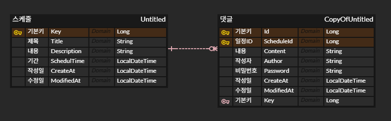

# 📘 일정 관리 앱 API 안내글

## 📌 프로젝트 개요
이 프로젝트는 일정 관리 앱을 이용하는 사용자의 일정을 등록하고, 해당 일정에 대해 댓글을 달 수 있는 앱입니다.
일정(Schedule)과 댓글(Comment)은 각각 엔티티 클래스로 구성하였습니다.
댓글은 각각의 일정에 달 수 있도록 하였습니다.
- 모든 일정과 댓글은 작성일과 수정일이 기록됩니다.
- 댓글은 최대 10개만 등록 가능합니다.

---

## 🗂️ 패키지 구조
com.project.schedule<br>
├── controller<br>
│     ├── CommentController.java<br>
│     └── ScheduleController.java<br>
├── dto<br>
│     ├── CommentRequest.java / CommentResponse.java<br>
│     └── ScheduleRequest.java / ScheduleResponse.java<br>
├── entity<br>
│     ├── BaseEntity.java<br>
│     ├── Comment.java<br>
│     └── Schedule.java<br>
├── repository<br>
│     ├── CommentRepository.java<br>
│     └── ScheduleRepository.java<br>
├── service<br>
│     ├── CommentService.java<br>
│     └── ScheduleService.java<br>

---

🧾 ERD (Entity Relationship Diagram)

| 필드명      | 타입           | 설명                                              |
|------------|----------------|---------------------------------------------------|
| `id`       | `Long`         | 일정 고유 식별자 (PK)                             |
| `title`    | `String`       | 일정 제목                                         |
| `content`  | `String`       | 일정 내용                                         |
| `author`   | `String`       | 작성자명                                          |
| `password` | `String`       | 일정 비밀번호 (저장은 하지만 응답에는 포함되지 않음) |
| `createdAt`| `LocalDateTime`| 작성일 (JPA Auditing 적용)                        |
| `modifiedAt`| `LocalDateTime`| 수정일 (JPA Auditing 적용)                       |

⚙️ `createdAt`과 `modifiedAt`은 **JPA Auditing**을 통해 자동으로 관리됩니다.

---

## 📮 일정 & 댓글 관리 API

### 🗓 Schedule API

| Method | Endpoint | Description |
|--------|----------|-------------|
| `POST` | `/schedules` | 일정 생성 |
| `GET` | `/schedules` | 모든 일정 조회 |
| `GET` | `/schedules/{scheduleId}` | 특정 일정 조회 (댓글 포함) |
| `PATCH` | `/schedules/{scheduleId}` | 일정 수정 |
| `DELETE` | `/schedules/{scheduleId}` | 일정 삭제 |


### 💬 Comment API

| Method | Endpoint | Description |
|--------|----------|-------------|
| `POST` | `/schedules/{scheduleId}/comments` | 댓글 생성 (최대 10개 제한) |

---


### 📥 ScheduleRequest 일정 요청 (Json)
```json
{
  "title": "두부와 망고 회의",
  "description": "두부와 망고 회의 오늘의 회고",
  "scheduleTime": "2025-08-04T14:00:00"
}
```

### 📤 ScheduleResponse 일정 응답 (Json)
```json
{
  "id": 1,
  "title": "두부와 망고 회의",
  "description": "두부와 망고 회의 오늘의 회고",
  "scheduleTime": "2025-08-04T14:00:00",
  "createAt": "2025-08-04T21:00:00",
  "modifiedAt": "2025-08-04T22:00:00",
  "comments": [
    {
      "id": 1,
      "content": "회고록 적어주세요.",
      "author": "홍길동",
      "createdAt": "2025-08-04T21:30:00",
      "modifiedAt": "2025-08-41T21:30:00"
    }
  ]
}
```
### 📤 CommentRequest 댓글 요청 (Json)
```json
{
  "content": "회고록 적어주세요.",
  "author": "홍길동",
  "password": "1234"
}
```
### 📤 CommentResponse 댓글 응답 (Json)
```json
{
  "id": 1,
  "content": "회고록 적어주세요.",
  "author": "홍길동",
  "createdAt": "2025-08-04T21:30:00",
  "modifiedAt": "2025-08-41T21:30:00"
}
```

---
### 🧱 ERD (Entity Relationship Diagram)


Schedule<br>
├── id: Long (PK)<br>
├── title: String<br>
├── description: String<br>
├── scheduleTime: LocalDateTime<br>
├── createdAt: LocalDateTime<br>
├── modifiedAt: LocalDateTime<br>
└── comments: List<Comment><br>

Comment<br>
├── id: Long (PK)<br>
├── content: String<br>
├── author: String<br>
├── password: String<br>
├── createdAt: LocalDateTime<br>
├── modifiedAt: LocalDateTime<br>
└── schedule_id: Long (FK → Schedule.id)


---

# 📌 향후 개발 예정
- 일정 조회 (GET)
- 일정 수정 (PUT)
- 일정 삭제 (DELETE)
- 비밀번호 검증 로직 추가
- 예외 처리 및 응답 포맷 통일

---
# ⚙️ 검증 규칙
- Schedule
  - 제목: 필수, 최대 30자
  - 내용: 필수, 최대 200자
  - 시간: 현재 이후만 등록 가능
- Comment
  - 일정당 최대 10개까지 작성 가능
---

## 🗂️ 기술 스택
- Java 17
- Spring Boot
- Spring Data JPA
- IntelliJ IDEA
- MySQL